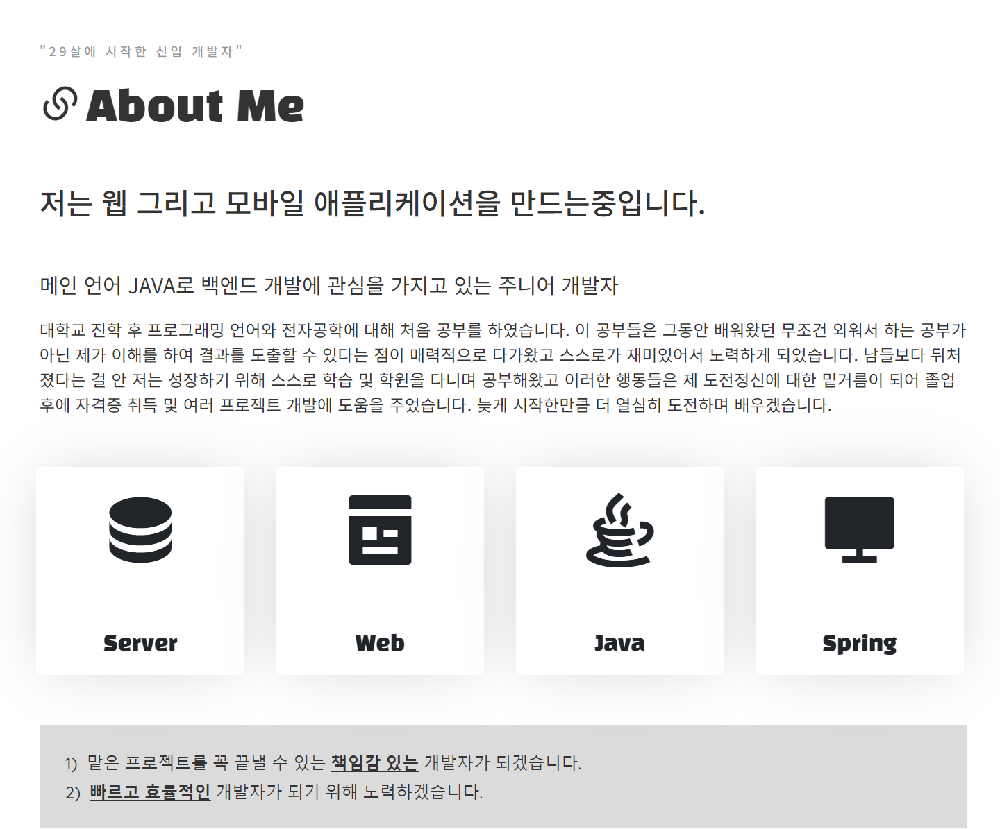
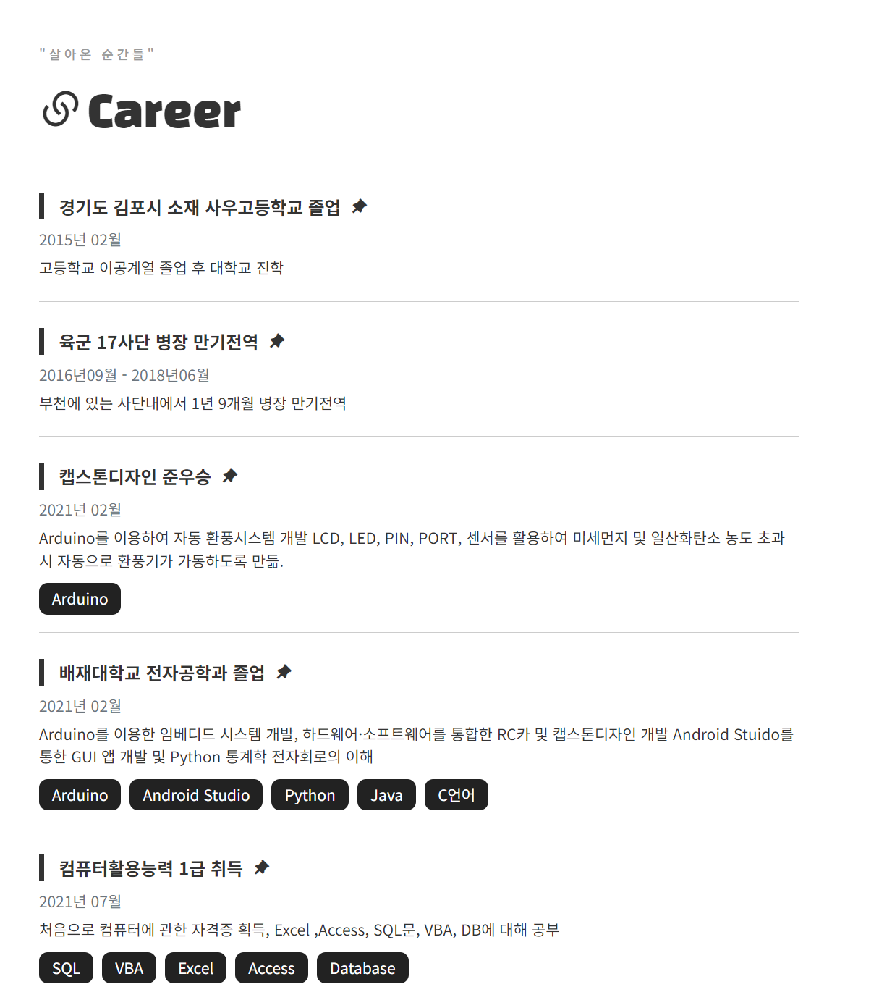
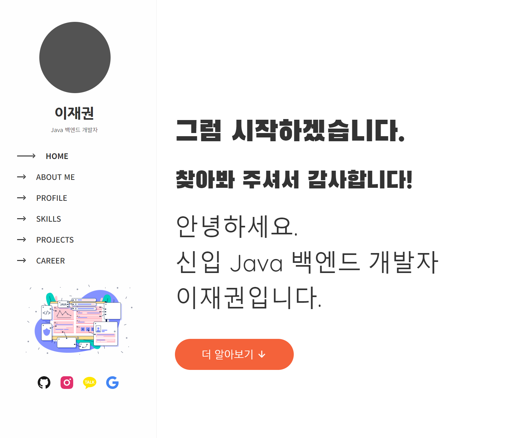

# 포트폴리오 웹사이트

개인 포트폴리오 웹사이트로, React와 JSON을 사용하여 프로젝트 데이터를 관리하고, 다양한 UI/UX 기능을 구현했습니다. 이 프로젝트는 개발자로서의 저의 기술 스택과 프로젝트 경험을 담고 있습니다.

## 프로젝트 개요
- **프로젝트 기간**: 2024.09.26 - 2024.10.06 (개인 프로젝트)
- **배포 URL**: [포트폴리오 웹사이트](https://jack1.blog)
- **주요 목적**: 
  - 저를 소개하고, 프로젝트 경험과 기술 스택을 한눈에 확인할 수 있도록 만든 웹사이트입니다.
  - React Hooks를 사용하여 컴포넌트 상태 관리와 성능 최적화를 목표로 했습니다.

## 주요 기능
- **프로젝트 관리**: JSON 파일로 프로젝트 데이터를 관리하여 가독성과 재사용성을 높임.
- **Carousel 기능**: 프로젝트 이미지를 캐러셀로 보여주는 기능 구현.
- **이벤트 처리**: Navigation에서 섹션별로 스크롤 이벤트와 클릭 이벤트를 활용한 화면 전환 기능.
- **React Hooks 사용**: 상태 관리와 컴포넌트 생명주기 관리의 간소화.

## 기술 스택
- **프론트엔드**: React, React Hooks
- **스타일링**: HTML5, CSS, Bootstrap
- **데이터 관리**: JSON
- **배포**: GitHub Pages

## 프로젝트 상세 설명

### 1. 프로젝트 및 데이터 관리
- 프로젝트 데이터는 JSON 파일(`projects.json`)로 관리하여 데이터의 가독성과 유지보수성을 확보했습니다.
- 각각의 프로젝트는 JSON 파일에서 인덱스를 기반으로 가져와 순차적으로 표시됩니다.

### 2. React 컴포넌트 구조
- **React Hooks**: `useState`와 `useEffect`를 사용해 상태를 관리하며, 컴포넌트의 생명주기를 간단하게 구현.
- **재사용 가능한 컴포넌트**: 프로젝트 카드, 캐러셀, README 모달 등을 각각의 컴포넌트로 나누어 관리.

### 3. 사용자 경험 (UX)
- 사용자가 사이트를 탐색하면서 쉽게 자신의 프로젝트와 기술 스택을 볼 수 있도록 네비게이션과 스크롤 이벤트를 추가.
- 모바일 및 다양한 디바이스에서 반응형으로 웹사이트가 잘 동작하도록 CSS 미디어 쿼리를 사용.

## 프로젝트 배경
29살에 개발자로의 전환을 결심하고, 수료한 Java 과정에서 배운 지식을 바탕으로 React를 독학하여 개발한 첫 포트폴리오입니다. 이 웹사이트를 통해 저 자신을 표현하고, 잠재적인 고용주나 동료에게 제 역량을 보여주기 위해 만들었습니다.

## 의미
- **혼자서 처음부터 끝까지** 계획하고 개발한 프로젝트입니다.
- JSON 데이터를 통해 프로젝트 정보를 동적으로 처리하는 방법을 학습하고, React의 기본 개념을 완벽하게 이해할 수 있었습니다.
- **무한 캐러셀 구현**과 **React Hooks**를 활용해 실무에서 활용할 수 있는 여러 기술을 적용했습니다.

## 이미지







## 설치 및 실행 방법
이 프로젝트를 로컬에서 실행하려면, 아래의 단계를 따라주세요:

### 1. 프로젝트 클론
```bash
git clone https://github.com/username/portfolio
cd portfolio
npm start

